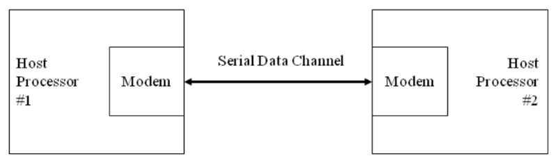
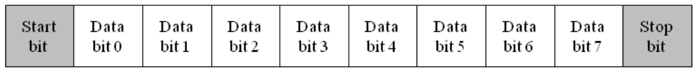
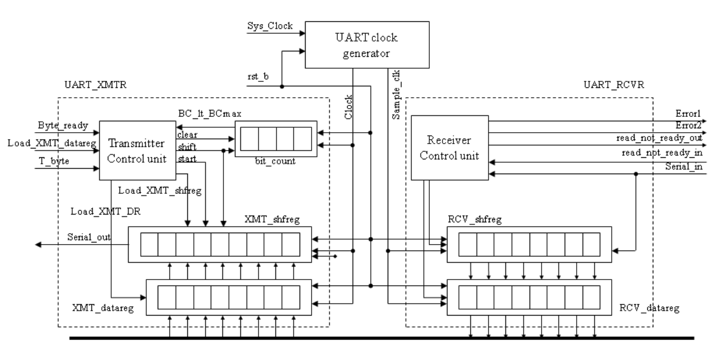
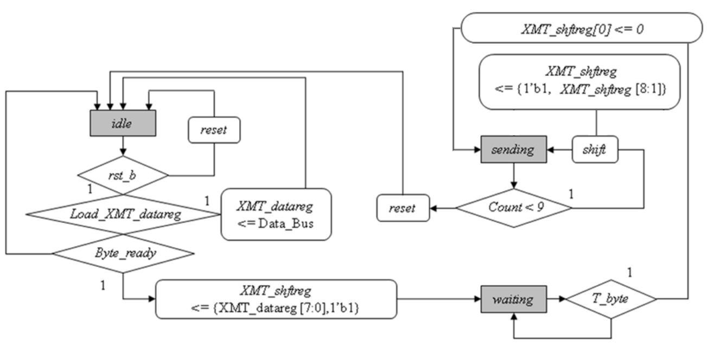
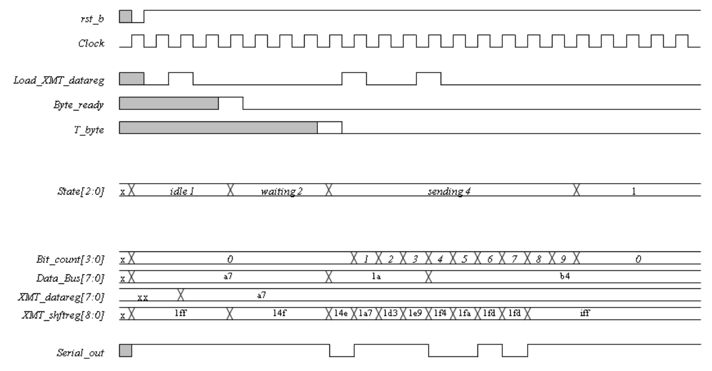
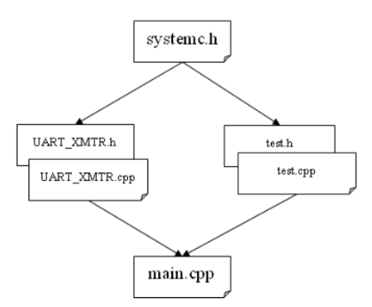

# ECEN 468/719 Advanced Logic Design

Department of Electrical and Computer Engineering  
Texas A&M University

# Lab 2: Design of UART Transmitter

## Objectives

In this lab, we will design a transmitter of Universal Asynchronous receiver/transmitter (UART) with SystemC. This module will be attached to our entire system later to transmit data to other devices or processors.

## Introduction

The UART is a type of asynchronous receiver/transmitter, a computer hardware that translates data between parallel and serial forms. UARTs are commonly used with communication standards such as EIA RS-232, RS-422, or RS-485. The universal designation indicates that the data format and transmission speeds are configurable. Figure 1 shows a general description of communication between processors through a serial channel. Those processors communicate internally with parallel data to speed up and use a serial channel to communicate with other processors to reduce the number of wires, so decreasing the cost of hardware.



*Figure 1. Communication over a serial channel*

For this lab, a UART transmits 8-bit data without a parity bit. For transmission, the modem wraps this 8-bit word with a start-bit in the least significant bit (LSB) and a stop-bit in the most significant bit (MSB), resulting in the 10-bit word format shown in Figure 2. The first 9 data bits of the word are transmitted in sequence, beginning with the start-bit, with each bit being asserted at the serial line for one cycle (bit-time) of the modem clock. The stop-bit may assert for more than one clock.



*Figure 2. Data format for UART transmission*

The simplified architecture of a UART is presented in Figure 3. It shows the signals used by a host processor to control the UART and to move data to and from a data bus in the host machine.



*Figure 3. Block diagram of the UART*

The input signals are provided by the host processor, and the output signal is the serial data stream. The architecture of the transmitter consists of a control unit, a data register (`XMT_datareg`), a data shift register (`XMT_shftreg`), and a status register (`bit_count`), which counts the bits that are transmitted.

The controller has the inputs (primary/external and status (from the datapath)) listed below. We note that the signal `Load_XMT_datareg` could be passed directly to the datapath unit; instead, we pass `Load_XMT_datareg` to the control unit and assert `Load_XMT_DR` conditionally when the state is `idle`, and the external signal `Load_XMT_datareg` is asserted. The status signal, `BC_lt_BCmax`, is asserted while bits are being sent, i.e., if `bit_count` < `word_size` + 1.

- `Load_XMT_datareg`: assertion is state `idle` asserts `Load_XMT_DR`, which loads the content of the `Data_Bus` into `XMT_datareg`.
- `Byte_ready`: assertion causes `Load_XMT_shftreg` to assert, which loads the contents of `XMT_datareg` into `XMT_shftreg`.
- `T_byte`: assertion initiates transmission of a byte of data, including the stop, start, and parity bits.
- `BC_lt_BCmax`: indicates the status of the bit counter in the datapath unit.



*Figure 4. Algorithmic State Machine and Datapath Chart (ASMD) for the UART transmitter*

The ASMD chart of the state machine controlling the transmitter is shown in Figure 4. The machine has three states: `idle`, `waiting`, and `sending`. When the active-low, synchronous reset signal `rst_b` is asserted, the machine enters `idle`, `bit_count` is flushed, and `XMT_shftreg` is loaded with 1s. In `idle`, if an active edge of `Clock` occurs while `Load_XMT_datareg` is asserted by the external host, it will load `XMT_datareg` with the contents of `Data_Bus`. The machine remains `idle` until the `start` is asserted to drop `XMT_shftreg[0]`.



*Figure 5. Waveforms of the 8-bit UART transmitter*

Figure 5 shows an example of the transmission timing. You can design your test bench referring to this timing graph. Also, you can check your result based on this timing graph.

## Implementation & Simulation

**We will now implement the transmitter part of the UART design.**

Please login to the Olympus server and create a working directory for this lab using the following commands.

```bash
## Create and navigate to the working directory.
mkdir -p $HOME/ECEN468/Lab2/src
cd $HOME/ECEN468/Lab2/src
```

Download the tar.gz file from the lab website and extract it. In the extracted folders, you will find the following files:

- `UART_XMTR.cpp`
- `UART_XMTR.h`
- `test.cpp`
- `test.h`
- `main.cpp`

Copy them to the working directory.

You will implement your code in `UART_XMTR.cpp`, `UART_XMTR.h`, and `main.cpp`. Figure 6 shows the hierarchical structure of the files in this lab.



*Figure 6. Hierarchy of the files for the UART system*

Once you complete the implementation, please verify the correctness of your design by simulation and viewing the waveform as in lab 1. Please take screenshots of the simulation output and the waveform and include them in the report.

Commands for reference:

```bash
load-ecen-468   # skip this line on machines in ZACH 127
source /opt/coe/synopsys/wv/V-2023.12-4/setup.wv.sh
wv &
```

## Submission

Please only submit one PDF file containing the following items:

1. Screenshots of the waveform with analysis.
2. Screenshots of the simulation output in Vista.
3. Screenshots of your code in this design with reasonable comments.

## Code Example

Pseudo code of UART state machine:

```
// State Machine Initialization
Initialize State Machine:
  If rst_b signal is low:
    CurrentState = IDLE
    Reset ShiftRegister and BitCounter
  Else:
    CurrentState = NextState

// State Machine Operation Logic
FSM:
  Execute the following actions based on the CurrentState:
  If CurrentState is IDLE:
    If Load_XMT_datareg signal is high:
      DataRegister = DataBus value
      NextState = IDLE
    Else If Byte_ready signal is high:
      ShiftRegister = DataRegister shifted left and appended with start bit (1'b1)
      NextState = WAITING
  If CurrentState is WAITING:
    If T_byte signal is high:
      ShiftRegister's LSB = 0
      NextState = SENDING
    Else:
      NextState = WAITING
  If CurrentState is SENDING:
    If BitCounter is less than WORD_SIZE + 1:
      ShiftRegister = ShiftRegister shifted right and appended with stop bit (1'b1)
      BitCounter = BitCounter + 1
      NextState = SENDING
    Else:
      BitCounter = 0
      NextState = IDLE
  Else:
    NextState = IDLE
  Write the LSB of ShiftRegister to Serial_out signal
```
