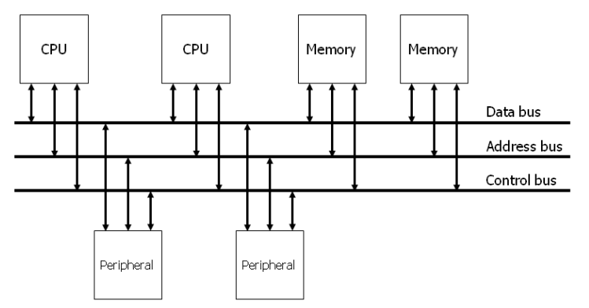
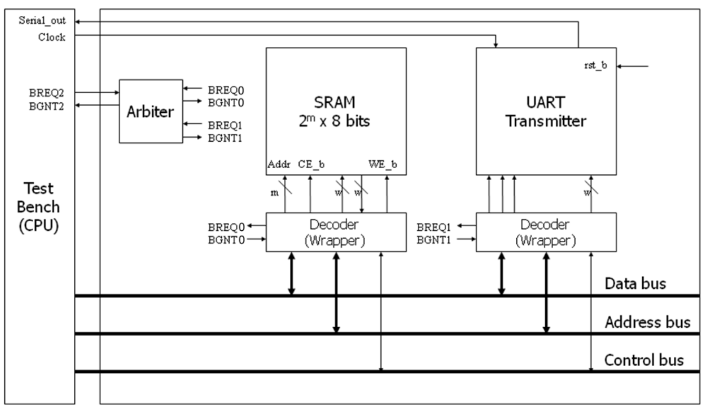
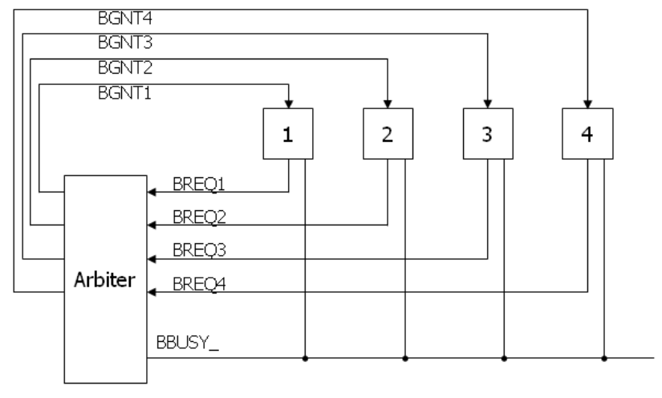
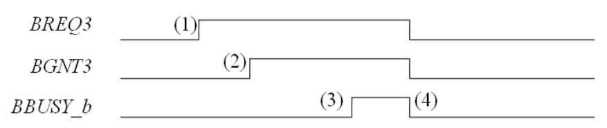
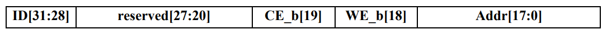
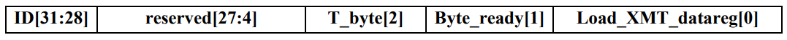
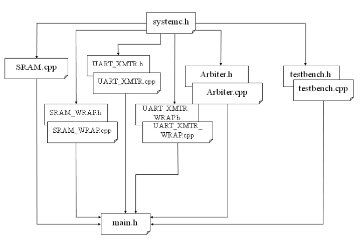
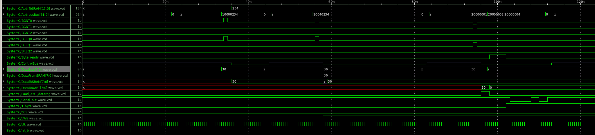

# ECEN 468/719 Advanced Logic Design

Department of Electrical and Computer Engineering  
Texas A&M University

# Lab 3: Design of System Bus

## Objectives

In this lab, we will design a System Bus with SystemC. Also, we will use this module to connect a 256K SRAM and UART, which has been implemented in previous labs.

## Introduction

In computer architecture, a bus is a sub-system that transfers data between components inside or between computers. Early computer buses were parallel electrical wires with multiple connections. Now the term is used for any physical arrangement that provides the same logical functionality as a parallel electrical bus. By using a system bus, the number of data pins used to connect all devices can be decreased sharply. It is easy to see in case of the system includes multiple CPUs and memory devices. A typical system bus is shown in Figure 1.



*Figure 1. System Bus*

A typical system bus consists of a data bus, an address bus, and a control bus, as shown in Figure 2. An address bus is used to specify a physical address. For example, when a processor or DMA-enabled device needs to read or write to a memory location, it specifies that memory location on the address bus (the value to be read or written is sent on the data bus). The width of the address bus determines the size of memory a system can address. A control bus is part of a computer bus used by CPUs for communicating with other devices within the computer. While the address bus carries the information on which device the CPU is communicating with, and the data bus carries the actual data being processed, the control bus carries commands and status signals from the devices.



*Figure 2. Connections of a system bus*

Since the bus is shared amongst all the devices, a method to avoid conflicts must be determined. The method used to determine who gets access to the bus is called **bus arbitration**. The bus arbitration mechanism is designed so that high-priority devices like the processor and RAM get first access to the bus. In contrast, other devices (disks, video cards, sound cards, etc.) get a lower priority and often have to wait until the bus is free. Several modes can be used for arbitration. In this lab, we will use **centralized fixed-priority arbitration**, as shown in Figure 3.



*Figure 3. Diagram of the centralized fixed-priority arbitration*

In Figure 3, there are three types of signals (`BREQ`, `BGNT`, and `BBUSY_`). The request (`BREQ`) signals are generated by the devices on the bus when they want to use the bus. The request signal is sent to the arbiter, waiting to be granted. If the bus is free and available, the arbiter sends a grant signal (`BGNT`) to the device it grants. If two or more request signals are generated at the same time, the arbiter compares their priorities and sends only one grant signal to the device that has a higher priority. The busy signal (`BBUSY_`) is used to indicate the status of the bus. If the bus is free, the `BBUSY_` signal is high (logic 1). If any device gets the right to use the bus, it reads data from the bus or writes data to the bus while pulling the `BBUSY_` signal low (logic 0). Once finished, it releases the `BBUSY_` signal to high.

Figure 4 shows an example of bus arbitration. (1) master 3 sends the request signal (`BREQ3`) to the arbiter while master 1 uses the bus. Hence the `BBUSY` signal is low. (2) The arbiter sends the grant signal (`BGNT3`). (3) Master 1 completes its operation and releases the `BBUSY_` signal (goes high), (4) Master 3 makes `BBUSY_` signal active (goes low) and starts to read or write to the bus.



*Figure 4. An example of bus arbitration*

In our lab, we assume the test bench has the highest priority, and the UART module has the lowest priority. In Figure 2, decoders are attached between SRAM/UART and the system bus. They are responsible for decoding the instructions from the system bus. In this lab, the address bus has 32 bits. The four most significant bits are used for the identification number (ID) of devices. The ID of the CPU (i.e., test bench) in our design is `0011`, the ID of SRAM is `0001`, and the ID of the UART transmitter is `0010`. The remaining bits on the address bus are used for control and address signals. Figure 5 and Figure 6 show the address map to the SRAM and the UART.



*Figure 5. Address map to the SRAM*



*Figure 6. Address map to the UART*

## Implementation & Simulation

Please login to the Olympus server and create a working directory for this lab using the following commands.

```bash
## Create and navigate to the working directory.
mkdir -p $HOME/ECEN468/Lab3/src
cd $HOME/ECEN468/Lab3/src
```

Download the tar.gz file from the lab website and extract it. In the extracted folders, you will find the following files:

- `SRAM_WRAP.cpp`
- `SRAM_WRAP.h`
- `UART_XMTR_WRAP.cpp`
- `UART_XMTR_WRAP.h`
- `Arbiter.cpp`
- `Arbiter.h`
- `test.cpp`
- `test.h`
- `main.cpp`

Please copy them to the working directory. Also, please copy `SRAM.cpp` (please rename `RAM.cpp` to `SRAM.cpp`) from lab 1 and `UART_XMTR.cpp`, `UART_XMTR.h` from lab 2 to the working directory.

Figure 7 shows the hierarchical structure of the file in this lab.



*Figure 7. Hierarchical structure of the files in this lab*

Modules `Arbiter` and `test` are already implemented in the code given. Please do a quick review of them to understand how it works.

Once you complete the implementation, please verify the correctness of your design by simulation and viewing the waveform. Please take screenshots of the simulation output and the waveform and include them in the report.

## Tips for some common errors

Declaration of the in-out signal and its usage:

- In `SC_MODULE()`:

  ```cpp
  sc_inout_rv <width> 'signal_name'
  'signal_name'.write("ZZZZZZZZ");
  'signal_name'.write(value);
  ```

- In `sc_main()`:

  ```cpp
  sc_signal_rv <width> 'signal_name'
  ```

If you see such an error in the simulation `(E115) sc_signal cannot have more than one driver:`, please write the following command in the command prompt.

`setenv SC_SIGNAL_WRITE_CHECK DISABLE`

If you see the type mismatch errors with some signals in `SRAM.cpp` (please rename `RAM.cpp` to `SRAM.cpp`), please modify your SRAM module, referring to the example at the end of this manual.



Commands for reference:

```bash
load-ecen-468   # skip this line on machines in ZACH 127
source /opt/coe/synopsys/wv/V-2023.12-4/setup.wv.sh
wv &
```

## Submission

Please only submit one PDF file containing the following items:

1. Screenshots of the waveform with analysis.
2. Screenshots of the simulation output in terminal.
3. Screenshots of your code in this design with reasonable comments.
4. Question: Suppose we have three devices (A, B, C) connected to the `Arbiter` on ports (2, 1, 0) in `Arbiter.h`, please list the order of the priorities of the three devices from high to low.

## Code Example

```cpp
SC_MODULE (SRAM) {
  sc_in_rv < ADDR_WIDTH > Addr ;
  sc_in bWE ;
  sc_in bCE ;
  sc_in_rv < DATA_WIDTH > InData ;
  sc_out_rv < DATA_WIDTH > OutData ;

  // ----- Internal variables -----
  sc_uint mem [RAM_DEPTH];
  uint data, adr;

  // ----- Code Starts Here -----
  // Memory Write Block
  // Write Operation : When bWE = 0, bCE = 0
  void write_mem () {
    if (!bCE.read() && !bWE.read()) {
      data=InData.read().to_uint();
      adr=Addr.read().to_uint();
      mem[adr] = data;
    }
  }

  // Memory Read Block
  // Read Operation : When bWE = 1, bCE = 0
  void read_mem () {
    if (!bCE.read() && bWE.read()) {
      adr = Addr.read().to_uint();
      OutData.write(mem[adr]);
    }
  }
};
```
