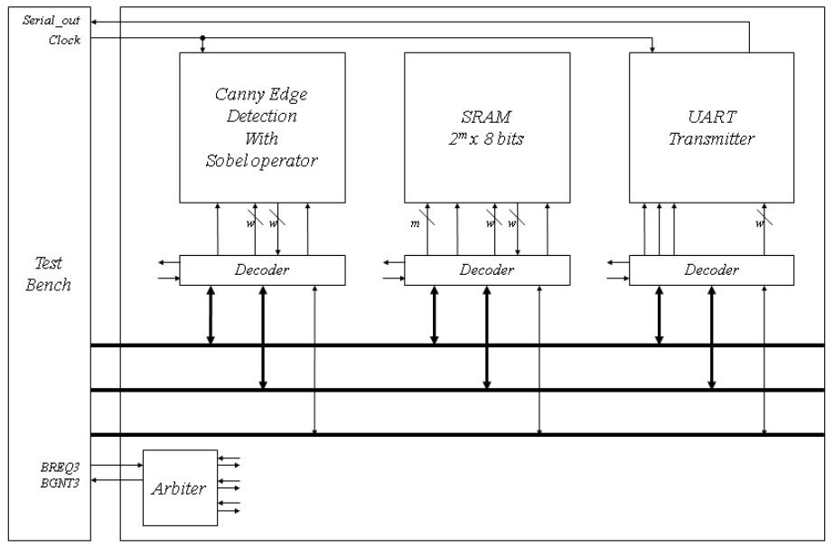
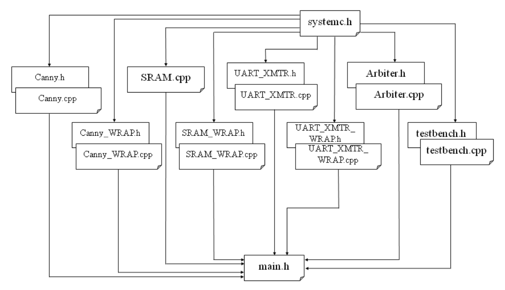

# ECEN 468/719 Advanced Logic Design

Department of Electrical and Computer Engineering  
Texas A&M University

# Lab 5: Combining Canny Edge Detector with System Bus, SRAM and UART

## Objectives

In this lab, we will combine Canny Edge Detector, SRAM, and UART through the system bus. We will use Vista for simulation and verification.



*Figure 1. Block diagram of the system*

## Combining the edge detector with the system bus

In lab 4, the image data moves between the test bench and the modules. The large internal memory required by the image was declared in the test bench. In this lab, we will use the SRAM to store the image. Figure 1 shows the entire system for this lab. The test bench is related only to BMP images in/out and control logic. It still has internal memory to read and write BMP files.


*Figure 2. Connection of the Canny Edge Detector and its decoder*


*Figure 3. Address map of the Canny Edge Detector*

Figure 2 shows signals interconnected between the Canny Edge Detector module and its decoder. To attach the module to the system bus, an address decoder (wrapper) is required to decode the control signals. Figure 3 shows the address map. The 4 most significant bits are used for the identification number of devices. We assume that the ID of the Canny Edge Detector is `0100`. The remaining is used for control signals and address signals for control.

Figure 4 shows an example of the noise reduction process. In the first step, the test bench sends all the data to memory. And then, only the data that needs to be fetched is transmitted from the memory to the test bench and finally into the Canny Edge Detector module. After completion of the block processing in the detector module, the data will be read by the test bench, and it will be sent back to the proper memory.


*Figure 4. Data flow of Noise Reduction*

For debugging, the system needs to send several messages through UART. In this lab, the messages should be sent to indicate the completion of each stage (i.e., noise reduction, gradient extraction, non-maximum suppression, and hysteresis thresholding).

The messages below should be sent through UART:

- Noise reduction: `'N'` = `0x4E`
- Gradient extraction: `'G'` = `0x47`
- Non-maximum suppression: `'S'` = `0x53`
- Hysteresis thresholding: `'H'` = `0x48`

## Reconfiguration of SRAM

We will expand the size of memory elements to support Canny Edge Detector. Figure 5 shows the memory maps to support it. While it operates with the Canny Edge Detector, it needs some space to store intermediate images such as an image whose noise is reduced, the gradient information, direction information, an image after the NMS process, the original image, and the final image after hysteresis thresholding. Thus, you will assign memory addresses for each memory block. Figure 5 is an example of memory allocation.


*Figure 5. SRAM memory allocation*

The memory size depends on the size of the images to be processed. You need to estimate the image size. For example, if the largest image you want to simulate is 200x200 pixels, then we need a memory larger than 200 x 200 x 5 x 8 bits. In this case, the address port of the SRAM should be at least 18 (`2^17 < 200 x 200 x 5 < 2^18`).

## Implementation & Simulation

**You will need to implement the wrapper for the Canny Edge Detector for this lab.**

Please login to the Olympus server and create a working directory for this lab using the following commands.

```bash
## Create and navigate to the working directory.
mkdir -p $HOME/ECEN468/Lab5/src
cd $HOME/ECEN468/Lab5/src
```

Download the tar.gz file from the lab website and extract it. In the extracted folders, you will find the following files:

- `Canny_Edge_WRAP.cpp`
- `Canny_Edge_WRAP.h`
- `Arbiter.cpp`
- `Arbiter.h`
- `test.cpp`
- `test.h`
- `main.cpp`

Copy them to the working directory. Please copy `SRAM_WRAP.cpp`, `SRAM_WRAP.h`, `SRAM.cpp`, `UART_XMTR.cpp`, `UART_XMTR.h`, `UART_XMTR_WRAP.cpp`, `UART_XMTR_WRAP.h` from Lab 3. Copy `Canny_Edge.cpp`, `Canny_Edge.h` from Lab 4. Figure 6 shows the hierarchy of the files for this lab.



*Figure 6. Hierarchy of the files*

The simulation for a 200 x 200 BMP file could take several minutes to complete. You want to start with a smaller file (`kodim23_50.bmp`) for faster debugging. To switch the input image, please change the input file name in `test.cpp`. Also, you need to change the value of the variable `dDummyData`. 200 x 200 BMP: `dDummyData` = 0; 50 x 50 BMP: `dDummyData` = 2.

Once you complete the implementation, please verify the correctness of your design by simulation. Please take screenshots of the simulation output and include them in the report.

Commands for reference:

```bash
load-ecen-468   # skip this line on machines in ZACH 127
source /opt/coe/mentorgraphics/vista/2024_2/setup.vista.linux.bash
vista &

source /opt/coe/synopsys/wv/V-2023.12-4/setup.wv.sh
wv &
```

## Submission

Please only submit one PDF file containing the following items:

1. Screenshots of the output images with analysis.
2. Screenshots of the simulation output in Vista.
3. Screenshots of your code in this design with reasonable comments.
