# ECEN 468/719 Advanced Logic Design

Department of Electrical and Computer Engineering  
Texas A&M University

# Lab 10: Design of Canny Edge Detector

## Objectives

In this lab, we will implement a Canny edge detector and use `xrun` for simulation and verification.

## Introduction

**Edge detection** refers to identifying and locating sharp discontinuities in an image. The discontinuities are abrupt changes in pixel intensity that characterize the boundaries of objects in a scene. Classical edge detection methods involve convolving the image with an operator (2-D filter), which is constructed to be sensitive to large gradients in the image while returning values of zero in uniform regions.

There is a vast number of edge detectors available, each designed to be sensitive to certain types of edges. Variables involved in selecting an edge detection operator include edge orientation and noise environment. The geometry of the operator determines a characteristic direction in which it is most sensitive to edges. Operators are optimized to look for horizontal, vertical, or diagonal edges. Also, edge detection is difficult in noisy images since the high-frequency components exist in both the noise and the edges. Attempts to reduce the noise result in blurred and distorted edges.

There are many ways to perform edge detection. The majority of different methods may be grouped into two categories: the gradient method and the Laplacian method. In general, the Laplacian method results in higher quality and complexity. We will use the gradient method to detect edges. The gradient method detects the edges by looking for the maximum and minimum in the first derivative of the image.

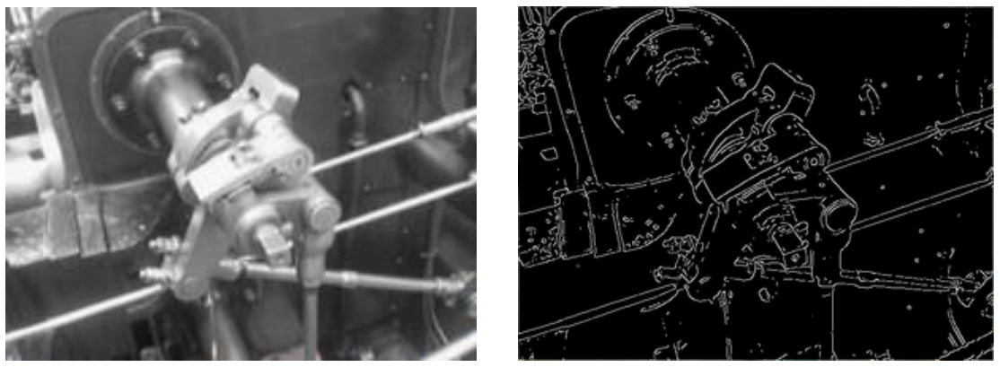

*Figure 1. An example of Canny Edge Detection*

### Edge Detection Flow

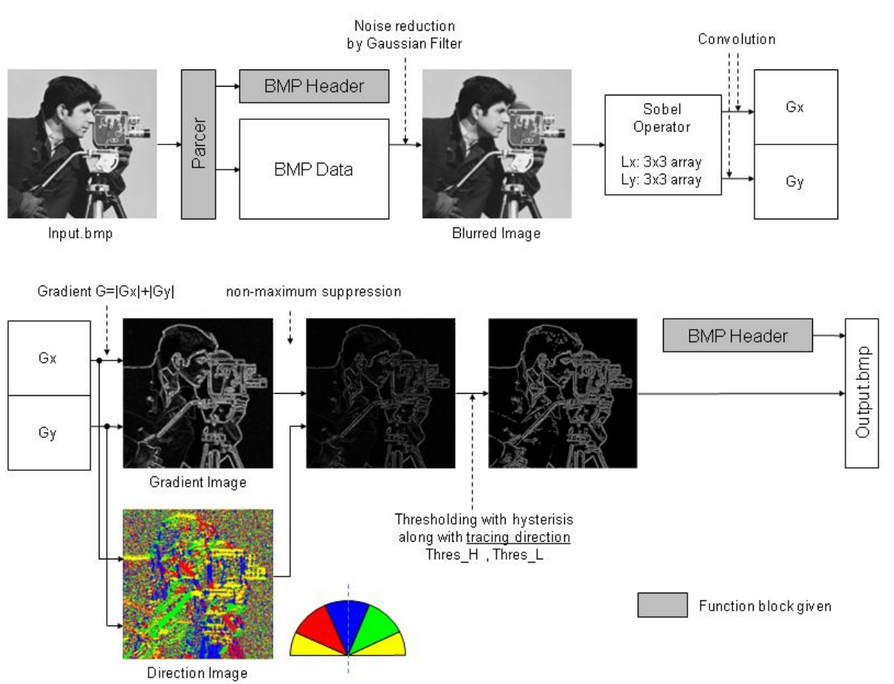

*Figure 2. Data flow of Edge Detection*

Figure 2 shows the data flow of a Canny Edge Detector. The input image will go through four operations: **Noise Reduction**, **Gradient Calculation**, **Non-maximum Suppression**, and **Thresholding**. The following sections introduce each part in detail.

### Noise Reduction

The first step is to filter out noises in the original image with the Gaussian filter. The Gaussian filter should be well defined since the filtering step not only eliminates the noise components but also results in the degradation of the image quality.

Once a suitable mask has been decided, the Gaussian smoothing can be performed using standard convolution methods. A convolution mask is usually much smaller than the actual image. As a result, the mask slides over the image, casting a square of pixels at a time. The larger the size of the Gaussian mask, the less the detector's sensitivity to noise. The localization error in the detected edges also increases slightly as the mask size increases. The Gaussian mask shown in Figure 3 will be used in this lab.

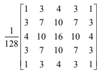

*Figure 3. Gaussian Mask G*

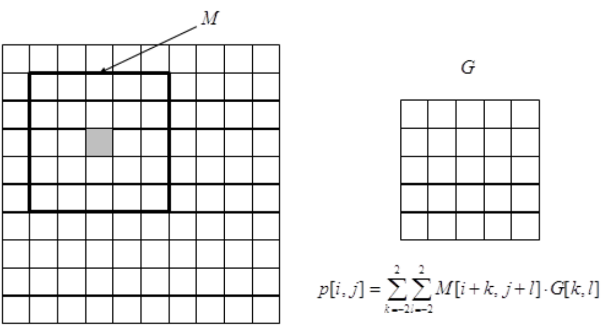

*Figure 4. Convolution using the Gaussian mask*

Figure 4 shows the process of convolution. For the grey pixel p[i,j] in the left image, the window M will be selected from the original image and used in the convolution. The value of the corresponding pixel in the smoothed image is calculated using the equation shown in the figure.

### Gradient Calculation

After smoothing the image and eliminating the noise, the next step is to find the edge strength by taking the gradient of the image. We use the Sobel operators in Figure 5 to perform a 2-D gradient measurement on an image. The Sobel operator uses a pair of 3x3 convolution masks, one estimating the gradient in the x-direction (Vertical edge) and the other estimating the gradient in the y-direction (Horizontal edge). The mathematical equations in Figure 6 give the gradient value Gx and Gy in the x and y directions.

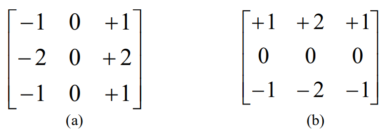

*Figure 5. Sobel operators (a) Sobel X, (b) Sobel Y*

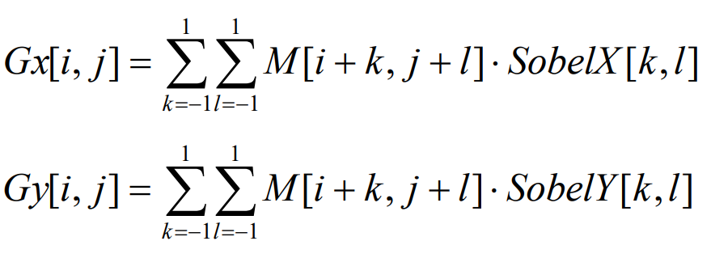

*Figure 6. Equations of gradient calculation*

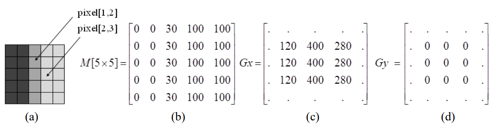

*Figure 7. An example of gradient calculation*

Figure 7 shows an example of gradient calculation. The 5x5 image in Figure 7 (a) has pixel values in Figure 7 (b). It contains vertical edges (i.e., a large gradient in the x direction). Figures 7 (c) and (d) show the gradient after applying the convolutional masks Sobel X and Sobel Y. For pixel [1,2], Gx = 400, Gy = 0. The large gradient in the x direction corresponds to the vertical edge at pixel [1,2]. For pixel [2,3], Gx = 280, Gy = 0. It also indicates a vertical edge at that location.

Based on Gx and Gy, we can calculate the **magnitude** and the **direction** of the gradient.

The **magnitude**, or edge strength, is approximated using the equation shown in Figure 8. It has a good performance with low computational complexity.

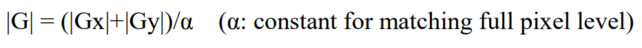

*Figure 8. The magnitude of the gradient*

In this equation, we use the constant value α for normalization. In our lab, each pixel is represented by eight bits, which gives a maximum value of 255. So the maximum value of Gx and Gy is `255*4`. Then, the maximum value of |Gx| + |Gy| is `255*8`. Therefore, setting α = 8 makes the value of |G| between 0 and 255.

However, for real images, if we use a constant 8 to normalize the gradient, the magnitudes of most gradients will be very small. Therefore, we can adjust the constant value according to our used images. Make sure that the magnitude should not exceed 255 in our system. **In this lab, please use α = 2.**

The **direction** of the gradient can be calculated using the equation in Figure 9. However, implementing the arctan function is expensive in hardware. Instead, we will use an approximation method to determine the direction of the gradient.

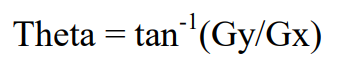

*Figure 9. The direction of the gradient*

The purpose of calculating the direction of the gradient is to determine the direction of the edge. We categorize the edges into horizontal (0 degrees), vertical (90 degrees), and diagonal (45 and 135 degrees), as shown in Figure 10. Using the approximation method in Figure 11, we can quickly determine the direction of the edge by comparing the values of Gx and Gy.

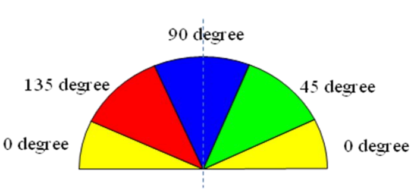

*Figure 10. Directions of the edges*

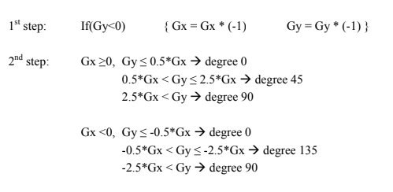

*Figure 11. An approximation method for gradient directions*

### Non-maximum Suppression

Figure 12 shows an example of non-maximum suppression. Suppose we want to do a non-maximum suppression for pixel C. Following the two directions perpendicular to the edge, we can find the two neighboring pixels, A and B.

1. If M(C) ≥ M(A) and M(C) ≥ M(B): discard pixels A and B by setting M(A) = M(B) = 0;
2. Otherwise (M(C) < M(A) or M(C) < M(B)): discard pixel C by setting M(C) = 0.

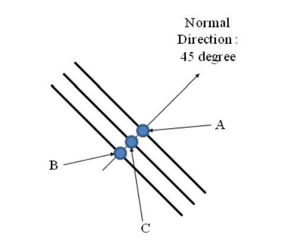

*Figure 12. Non-maximum suppression*

### Hysteresis Thresholding

The output of the non-maximum suppression still contains noisy local maxima. In this lab, we use the hysteresis thresholding method to remove the noise further and improve the image quality.

The thresholds need to be set carefully to remove the weak edges while preserving the connectivity of the contours. This algorithm uses two thresholds, `T_high` and `T_low`.

1. A pixel (x,y) is called **strong** if M(x,y) ≥ `T_high`;
2. A pixel (x,y) is called **weak** if M(x,y) ≤ `T_low`;
3. A pixel (x,y) is a candidate pixel otherwise (i.e., `T_low` < M(x,y) < `T_high`).

In each position of (x,y), we:

1. discard the pixel (x,y) if it is weak;
2. keep the pixel if it is strong;
3. If the pixel is a candidate, we should check its two neighbor pixels on its edge directions.
   - If the candidate pixel (x,y) is connected to a strong neighbor, keep the pixel;
   - If the candidate pixel (x,y) is connected to another candidate pixel that has already been regarded as a strong pixel, keep this candidate pixel;
   - Otherwise, discard the candidate pixel.

In our lab, please use `T_high` = 15 and `T_low` = 10.

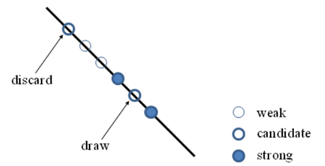

*Figure 13. Hysteresis thresholding*

## Implementation & Simulation

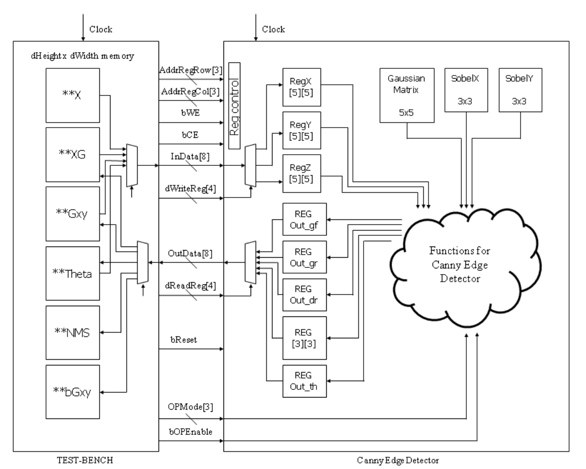

*Figure 14. Data flow of the top module and test bench.*

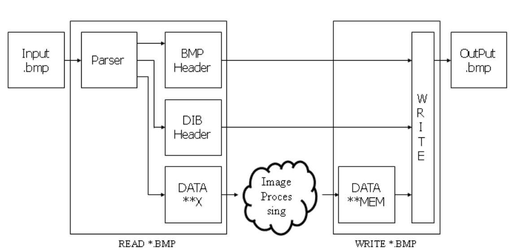

*Figure 15. File in/out process*

Figures 14 and 15 show the structure of the design.

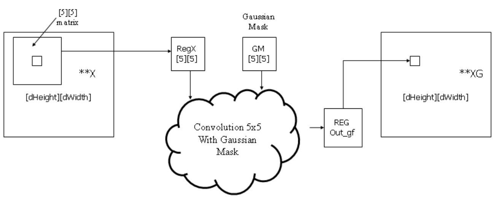

*Figure 16. Data flow of noise reduction*

Figure 16 shows the data flow of the noise reduction process. In the first step, the top module receives 5x5 data of the original image (`**X`) from the test bench. And the array of data is convolved with a Gaussian mask for noise reduction at the noise reduction phase. Finally, the data is loaded into register `Out_gf`, and it goes out to another memory area (`**XG`) on the test bench.

### Useful Verilog Skills

**Array**

**One-dimensional Array**

We have implemented two-dimensional array `sc_uint<8> regX[5][5]` in SystemC. Almost all Verilog simulators do not provide two-dimensional expressions. Thus, you may implement it with one-dimensional expressions and use it with indexing. For example, if we want to implement the 5x5 array, you can declare `reg [7:0] regX[0:24]`, and the index is from 0 to 24. To be supported by all kinds of simulators and synthesizable, it is recommended to use one-dimensional arrays. But, you may use the two-dimensional array expression for the functional simulation.

`Index = Row number * 5 + Column number`

**reg signed**

```verilog
reg [7:0] RegX[0:24];        // 25 unsigned registers, 8 bits wide
reg signed [7:0] RegX[0:24]; // 25 signed registers, 8 bits wide
```

**Shift Right instead of the divide operation**

When you synthesize modules, cell libraries may not have appropriate libraries for divide operation. To support all libraries, it is recommended to use the shift right operation with the sign `>>`:

- Divided by 2 → `(variable) >> 1`
- Divided by 4 → `(variable) >> 2`
- e.g., `var <= var / 128;` → `var <= (var >> 7);`

### Simulation and Verification

Please login to the Olympus server and create a working directory for this lab using the following commands.

```bash
## Create and navigate to the working directory.
mkdir -p $HOME/ECEN468/Lab10/src
cd $HOME/ECEN468/Lab10/src
```

Download the tar.gz file from the lab website and extract it. In the extracted folders, you will find the following files:

- `CannyEdge.v`
- `tb.v`
- `tb_comp.v`
- `generic.sdb`
- `osu018_stdcells.v`
- `osu018_stdcells.db`

Copy them to the working directory.

Please implement your design in `CannyEdge.v`.

The simulation will show the matching ratio between the images generated by your implementation and the reference images.

Commands for reference:

```bash
load-ecen-468   # skip this line on machines in ZACH 127
source /opt/coe/cadence/XCELIUM240/setup.XCELIUM240.linux.bash
xrun -c   # (complete the rest of the cmd)
xrun -R   # (complete the rest of the cmd)
```

Please take screenshots of the terminal output and include them in the report.

**Then use the `check.py` to verify your result:**

`python3 check.py`

## Synthesis

**Gate-level design generation**

Please write down your own tcl file to use `dc_shell` to generate the netlist of `CannyEdge.v`.

The gate-level design should be named as `CannyEdge_gate.v`.

Please attach your own tcl file in your lab report, and your `CannyEdge_gate.v` file as well.

Commands for reference:

```bash
source /opt/coe/synopsys/syn/V-2023.12-SP1/setup.syn.sh
dc_shell -f <your_own_tcl> > output.txt
```

Please attach your `output.txt` in the lab report.

**The gate-level simulation is not required.**

## Submission

Please only submit one PDF file containing the following items:

1. Screenshots of the images generated by the simulation.
2. Screenshots of the simulation outputs.
3. Screenshots of running `check.py`.
4. Source code in this design with reasonable comments.
5. Gate level design. (`CannyEdge_gate.v`)
6. `dc_shell` output. (`output.txt`)

A matching ratio of at least 98% is required to get full marks.
