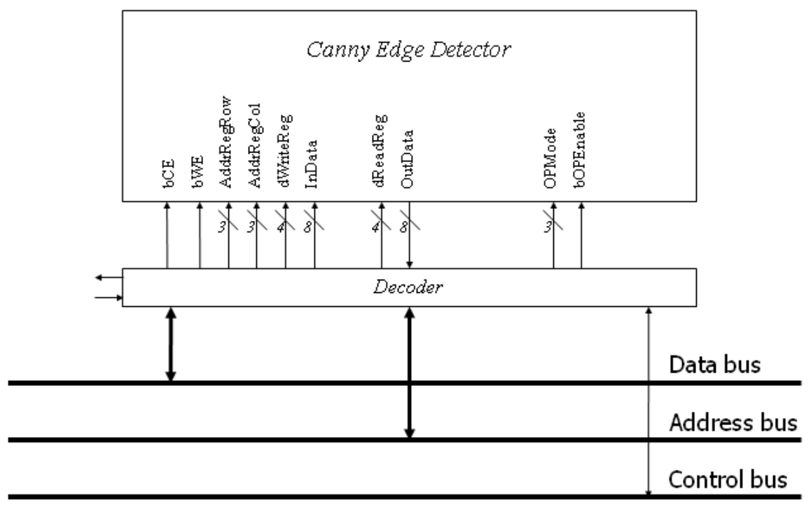
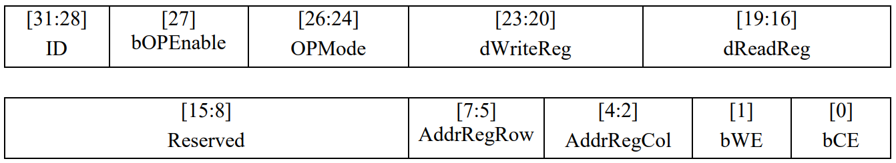
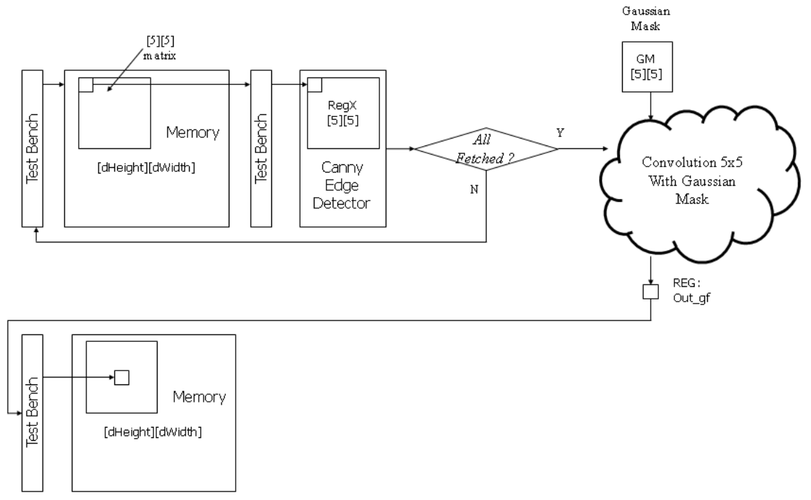
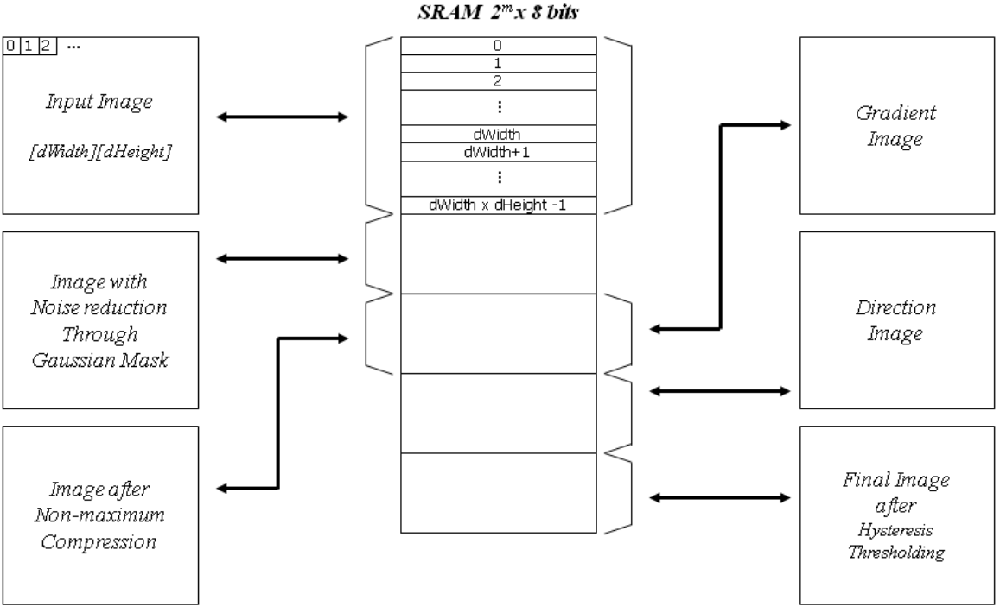

# ECEN 468/719 Advanced Logic Design

Department of Electrical and Computer Engineering  
Texas A&M University

# Lab 11: Combining Canny Edge Detector with System Bus, Memory and UART

## Objectives

In this lab, we will combine the Canny Edge Detector, SRAM, and UART through the system bus.


*Figure 1. Block diagram of the system*

## Combining the edge detector with the system bus

In lab 10, the image data moves between the test bench and the modules. The large internal memory required by the image was declared in the test bench. In this lab, we will use the SRAM to store the image. Figure 1 shows the entire system for this lab. The test bench is related only to BMP image in/out and control logic. It still has internal memory to read and write BMP files.



*Figure 2. Connection of the Canny Edge Detector and its decoder*



*Figure 3. Address map of the Canny Edge Detector*

Figure 2 shows signals interconnected between the Canny Edge Detector module and its decoder. To attach the module to the system bus, an address decoder (wrapper) is required to decode the control signals. Figure 3 shows the address map. The 4 most significant bits are used for the identification number of devices. We assume that the ID of the Canny Edge Detector is `0100`. The remaining bits are used for control and address signals.

Figure 4 shows an example of the noise reduction process. In the first step, the test bench sends all the data to memory. And then, only the data that needs to be fetched is transmitted from the memory to the test bench and finally into the Canny Edge Detector module. After the block processing in the detector module is complete, the data will be read by the test bench and sent back to the proper memory.



*Figure 4. Data flow of Noise Reduction*

For debugging, the system needs to send several messages through UART. In this lab, the messages should be sent to indicate the completion of each stage (i.e., noise reduction, gradient extraction, non-maximum suppression, and hysteresis thresholding).

The messages below should be sent through UART:

- Noise reduction: `'N'` = `0x4E`
- Gradient extraction: `'G'` = `0x47`
- Non-maximum suppression: `'S'` = `0x53`
- Hysteresis thresholding: `'H'` = `0x48`

## Reconfiguration of SRAM

We will expand the size of the memory elements to support the Canny Edge Detector. Figure 5 shows the memory maps to support it. While it operates with the Canny Edge Detector, it needs some space to store intermediate images such as an image whose noise is reduced, the gradient information, direction information, an image after the NMS process, the original image, and the final image after hysteresis thresholding. Thus, you will assign memory addresses for each memory block. Figure 5 is an example of memory allocation.



*Figure 5. SRAM memory allocation*

The memory size depends on the size of the images to be processed. You need to estimate the image size. For example, if the largest image you want to simulate is 200x200 pixels, then we need a memory larger than 200 x 200 x 5 x 8 bits. In this case, the address port of the SRAM should be at least 18 (`2^17 < 200 x 200 x 5 < 2^18`).

## Implementation & Simulation

**You will need to implement the wrapper for the Canny Edge Detector for this lab.**

Please login to the Olympus server and create a working directory for this lab using the following commands.

```bash
## Create and navigate to the working directory.
mkdir -p $HOME/ECEN468/Lab11/src
cd $HOME/ECEN468/Lab11/src
```

Download the tar.gz file from the lab website and extract it. In the extracted folders, you will find the files `WRAP_CANNY.v`, `Arbiter.v`, `systemtop.v`, `tb.v`, `tb_comp.v`, `generic.sdb`, `osu018_stdcells.v`, and `osu018_stdcells.db`. Copy them to the working directory.

Please copy `WRAP_SRAM.v`, `SRAM.v`, `virtSRAM.v`, `WRAP_UART.v`, `UART_XMTR.v`, `Control_Unit.v`, `Datapath_Unit.v`, and `CannyEdge.v` from previous labs into the working directory. **For the Canny Edge design, please change the high threshold to 10 and the low threshold to 3.**

**You will need to insert code in the test bench (`tb.v`).** Please refer to the code in the Gaussian smoothing process, then complete the test bench for the memory operations, UART transmitter, gradient magnitude and direction, non-maximum suppression, and hysteresis thresholding process.

Commands for reference:

```bash
load-ecen-468
source /opt/coe/synopsys/vcs/W-2024.09-SP2-4/setup.vcs.sh
vcs -full64 tb.v   # if you use a two-dimensional array
./simv
vcs -full64 tb_comp.v
./simv
```

## Synthesis

The 256K SRAM is too large to synthesize. We will replace `SRAM.v` with `virtSRAM.v`. The module should have precisely the same in/out ports as your SRAM module.

Please open `systemtop.v`, and modify `` `include "SRAM.v" `` to `` `include "virtSRAM.v" ``.

Run the command below to invoke Design Vision.

```bash
## Create and navigate to a separate working directory.
mkdir $HOME/ECEN468/Lab11/src/dv_Work
cd $HOME/ECEN468/Lab11/src/dv_Work

## Launch Design Vision
source /opt/coe/synopsys/syn/V-2023.12-SP1/setup.syn.sh
design_vision &
```

In Design Vision, please do the same steps as in the previous labs:

- Link the libraries
- Analyze
- Elaborate
- Compile
- **File -> Save as** -> `systemtop_gate.v`
- `write_sdf systemtop.sdf`
- Copy `systemtop.sdf` and `systemtop_gate.v` to the parent directory

**Gate Simulation**

For gate simulation, we need `systemtop_gate.v`, `systemtop.sdf`, `osu018_stdcells.v`, and the test bench.

Open `systemtop_gate.v`; you will find the SRAM module synthesized with `virtSRAM.v`. Please comment out the SRAM module in `systemtop_gate.v`. We will use the original SRAM module from `SRAM.v` for the gate simulation.

We will use the previous test bench as a template to create a test bench for the gate simulation.

`cp tb.v gate_tb.v`

Please open the new test bench `gate_tb.v` and do the following modifications:

- Make sure the following four lines are on the top of the file.

  ```verilog
  `timescale 1ns/10ps
  `include "systemtop_gate.v"
  `include "osu018_stdcells.v"
  `include "SRAM.v"
  ```

- Remove the following line if it exists.

  ```verilog
  `include "systemtop.v"
  ```

- Make sure the following two lines are at the bottom of the file. (within the module entity)

  ```verilog
  initial
      $sdf_annotate("systemtop.sdf", systemtop_01);
  ```

- If you want to generate the waveform file, change the name of the dump file to `wave_gate.dump` in your test bench. **Please note that the file size will be huge, so be careful when you generate it. You may delete the file after completing this lab to free space on your Linux server.**

  `$dumpfile("wave_gate.dump");`

Run the following command to start the simulation.

```bash
source /opt/coe/synopsys/vcs/W-2024.09-SP2-4/setup.vcs.sh
vcs -full64 gate_tb.v
./simv
vcs -full64 tb_comp.v
./simv
```

**If you see the error below, please make changes to modules `WRAP_SRAM`, `WRAP_UART`, and `WRAP_CANNY` in the `systemtop_gate.v` file.**

```
Err : The 32-bit expression "AddressBus" is connected to 20-bit port "AddressBus". - change "tri [19:0] AddressBus" to "tri [31:0] AddressBus";
Err : The 32-bit expression "AddressBus" is connected to 4-bit port "AddressBus". - change "tri [31:28] AddressBus" to "tri [31:0] AddressBus";
Err : The 32-bit expression "AddressBus" is connected to 16-bit port "AddressBus". - change "tri [31:16] AddressBus" to "tri [31:0] AddressBus";
```

## Submission

Please only submit one PDF file containing the following items:

systemtop:

1. Screenshots of the terminal output after running `./simv`.
2. Images generated by the simulation.
3. Justification of the correctness of the results.
4. Screenshots of the code you implemented.

systemtop Gate:

1. Screenshots of the simulation output after running `./simv`.
