# ECEN 468/719 Advanced Logic Design

Department of Electrical and Computer Engineering  
Texas A&M University

# Lab 12: Introduction to Verilog AMS and Simulator

## Purpose

Verilog-AMS HDL is a standard modeling language for analog circuits, and Virtuoso is a simulator for Verilog AMS. We will design a simple application: Phase Locked Loop with Verilog AMS and use Virtuoso for simulation.

## Preparation

### 1. Brief introduction to PLL (Phase Locked Loop)

We will simulate the functionality of a PLL. A phase-locked loop or phase lock loop (PLL) is a control system that generates an output signal whose phase is related to the phase of an input "reference" signal. It is an electronic circuit with a variable frequency oscillator and a phase detector. This circuit compares the phase of the input signal with the phase of the signal derived from its output oscillator and adjusts the frequency of its oscillator to keep the phases matched. The signal from the phase detector is used to control the oscillator in a feedback loop.

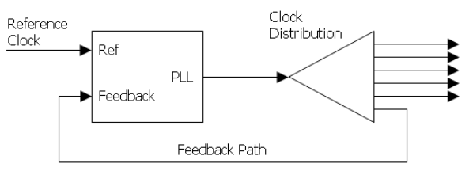

*Figure 1. Clock Distribution*

Frequency is the derivative of phase. Keeping the input and output phase in the lock step implies keeping the input and output frequencies in the lock step. Consequently, a phase-locked loop can track an input frequency, or it can generate a frequency that is a multiple of the input frequency. We will simulate properties that are used for indirect frequency synthesis or demodulation.

Figure 1 shows the clock distribution of the PLL block. Typically, the reference clock enters the chip and drives a phase-locked loop (PLL), which drives the system's clock distribution. The clock distribution is usually balanced so that the clock arrives at every endpoint simultaneously. One of those endpoints is the PLL's feedback input. The function of the PLL is to compare the distributed clock to the incoming reference clock and vary the phase and frequency of its output until the reference and feedback clocks are phase and frequency matched.

A PLL includes a Phase detector, Low-pass filter, Variable-frequency oscillator, and feedback path (which may include a frequency divider), as shown in Figure 2.

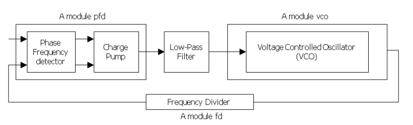

*Figure 2. Phase Locked Loop block diagram*

A phase detector compares two input signals and produces an error signal which is proportional to their phase difference. The error signal is then low-pass filtered and used to drive a VCO, which creates an output phase. The output is fed through an optional divider back to the input of the system, producing a negative feedback loop. If the output phase drifts, the error signal will increase, driving the VCO phase in the opposite direction to reduce the error. Thus the output phase is locked to the phase at the other input. This input is called the reference.

### 2. Description of Verilog AMS

Verilog-AMS Hardware Description Language (HDL) is derived from the IEEE 1364 Verilog HDL specification. The intent of Verilog-AMS HDL is to let designers create and use modules that encapsulate high-level behavioral descriptions as well as structural descriptions of systems and components. The behavior of each module can be described mathematically in terms of its terminals and external parameters applied to the modules. The structure of each component can be described in terms of interconnected sub-components. These descriptions can be used in many disciplines, such as electrical, mechanical, fluid dynamics, and thermodynamics.

A system is considered to be a collection of interconnected components that are acted upon by a stimulus and produce a response. The components themselves might also be systems. If a component does not have any sub-components, then it is considered a primitive component. Each primitive component connects to one or more nodes. The behavior of each component is defined in terms of signal values at each node. The components connect to nodes through ports to build a hierarchy as shown in Figure 3.

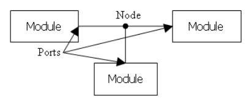

*Figure 3. Components connect to nodes through ports*

To simulate systems, it is necessary to have a complete description of the system and all of its components. Descriptions of systems are given structurally. That is, the description of a system contains instances of components and how they are interconnected. Descriptions of primitive components are given behaviorally. That is, a mathematical description is given that relates the signals at the ports of the component.

### 3. Functional Simulation

Make a working folder for this lab.

```bash
mkdir -p $HOME/ECEN468/Lab12/src              # make work folder
cd $HOME/ECEN468/Lab12/src                    # move to work folder
/opt/coe/ncsu/ncsu-cdk-1.6.0.beta/ncsu.sh     # start Virtuoso
```

Then, this will load Virtuoso, and you will see the Command Interpreter Window (CIW) as shown in Figure 4.

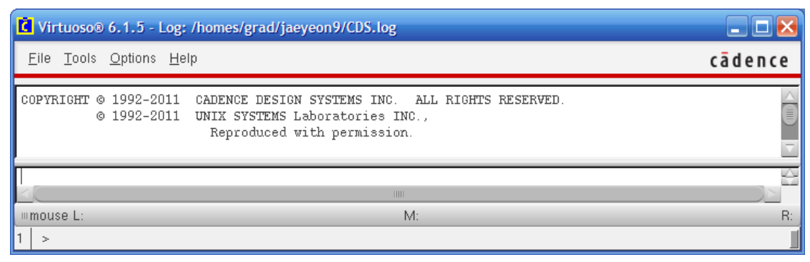

*Figure 4. Command Interpreter Window (CIW)*

Select **Tools -> Library Manager** to open Library Manager (Figure 5). In Library Manager, there are three main sections: Library, Cell, and View. The Library section lists all libraries, which contain all their cells such as `vexp`, `vnpn`, `vpnp`, `vpulse`, and so on. Each cell can be viewed in different views such as symbols, schematics, and so on, as shown in the View section.

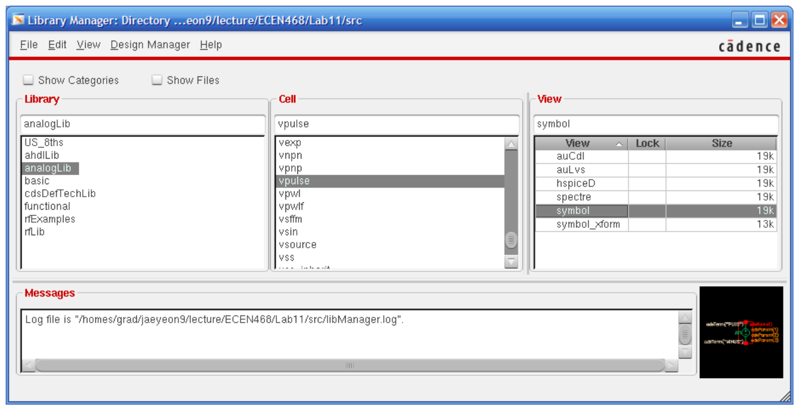

*Figure 5. Library Manager*

You will follow these steps to design and simulate the PLL in this lab:

- 3.1. Creating Library
- 3.2. Creating Cells
- 3.3. Connect Cells and Make PLL
- 3.4. Connect input pulse to PLL
- 3.5. Simulation

#### 3.1. Creating Library

You will create a library which will contain cells such as Phase Frequency Detector (PFD), Voltage Controlled Oscillator (VCO), Frequency Divider (FD), and top module. From the Library Manager, select **File -> New -> Library**. In the New Library window (Figure 6(a)), write `PLL` as the name of the library and click **OK**. And, you will use reference existing technology libraries as a technology file as shown in Figure 6(b). In the reference existing technology libraries window, move all technology libraries in the left box to the right box (Figure 6(c)). Then, you will see the `PLL` library in the Library section in Library Manager.

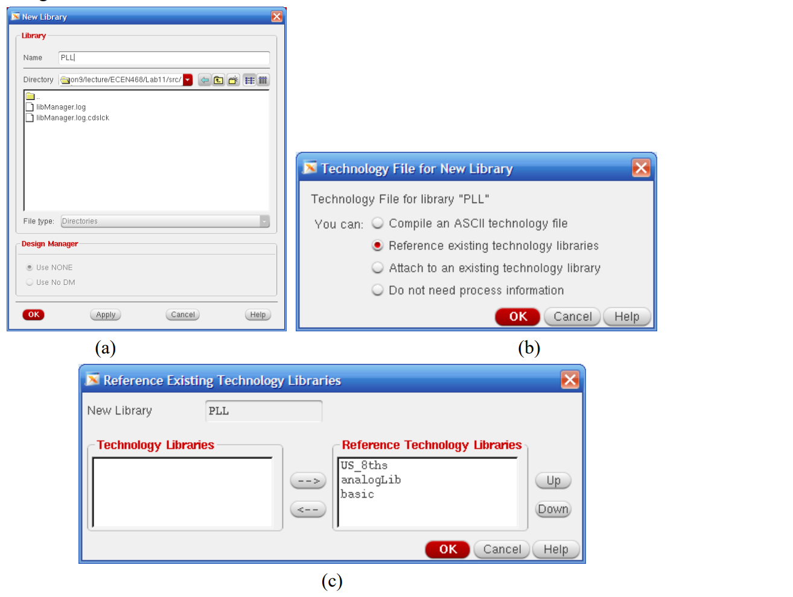

*Figure 6. Creating a Library. (a) New Library window, (b) Technology options, (c) reference existing technology libraries window*

#### 3.2. Creating Cells

We will create cells in `PLL` and start to design with the Phase Frequency Detector (PFD). Figure 7 shows the entire schematic of the input signal and PLL which will be implemented in this lab. To create a cell PFD, click `PLL` in the Library section, and select **File -> New -> Cell View**. And write `pfd` as a cell name and choose `VerilogA` as a type of the cell as shown in Figure 8(a). And click **OK**. If you see the question about the next license, click **Always** to keep this rule for the next license options (Figure 8(b)).

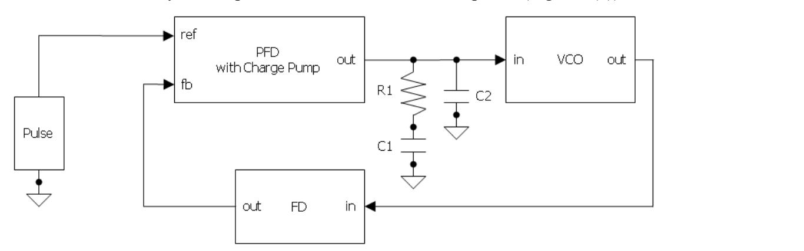

*Figure 7. Schematic of the input signal and PLL*

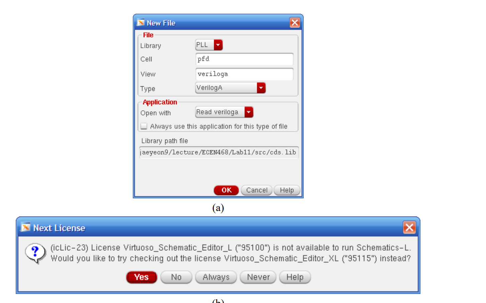

*Figure 8. Processes of creating a cell*

Then, an editor will be opened, and it has the default contents of the cell `pfd`. Write only the input and output signal names as shown in Figure 9. It will automatically generate the ports while we make a symbol of this cell.

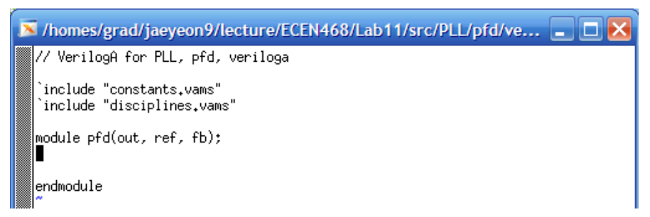

*Figure 9. Verilog A file of the PFD cell*

After closing the editor, a dialog about a symbol will be viewed because we do not have a symbol of the PFD cell yet. Just click **Yes** to create it. The names of the default signals will be shown in the Symbol generation option dialog (Figure 10(a)) because we already defined the input and output signals with the Verilog A module. Change the pins to proper positions. For `ref` and `fb` (feedback), put them in the Left Pins editor, and for the `out` pin, put it in the Right Pins. And click the **List** button to select the direction of the signals. Change the direction of `ref` and `fb` to an input, and for `out`, change to an output.

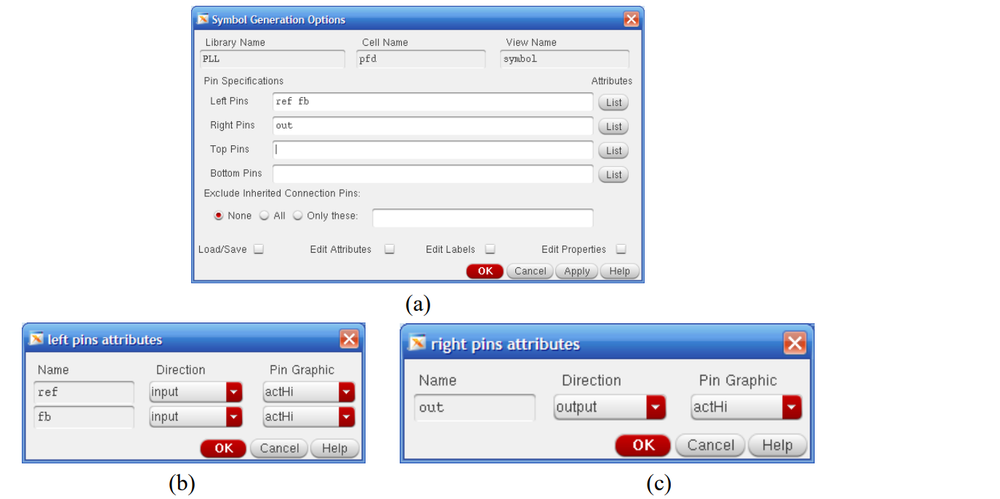

*Figure 10. Symbol generation option dialog for the PFD cell*

Then, you will see the `pfd` symbol as shown in Figure 11. It is a default symbol for the `pfd` module. You can make it fancy or any shape you want. Then, just close the window.

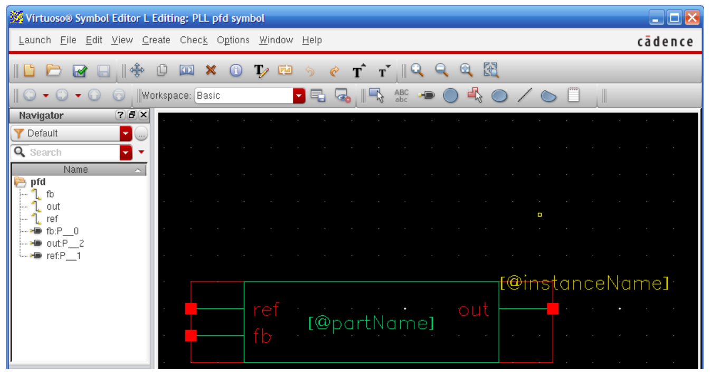

*Figure 11. Symbol view of pfd module*

After closing the window, you will be back in Library Manager. Now it shows the `pfd` cell in the `PLL` library list (Figure 12).

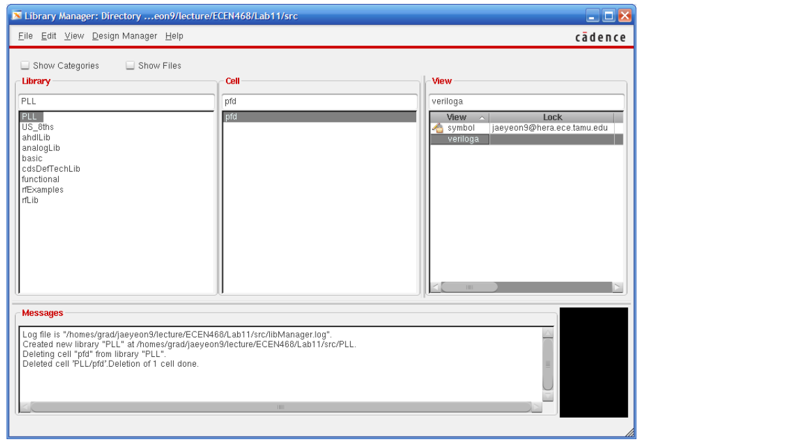

*Figure 12. Library Manager, pfd cell generation*

In the View section, the Phase Frequency Detector cell has a symbol view and a veriloga view. If you click **symbol view** in the View section, you will see its symbol view (Figure 11). If **veriloga**, it will open an editor for veriloga.

**If you are familiar with the editor, you can just describe the PFD module in the editor. Or, you can use any editor to modify a veriloga file. You will find the veriloga file (`veriloga.va`) at the path below. You may refer to the codes at the end of the manual.**

`ECEN468/Lab12/src/PLL/PFD/veriloga`

**Create the Frequency Divider and Voltage Controlled Oscillator referring to section 3.2.**

- **Frequency Divider**
  - name: `fd`
  - input name: `in` (to Right Pins)
  - output name: `out` (to Left Pins)
- **Voltage Controlled Oscillator**
  - name: `vco`
  - input name: `in` (to Left Pins)
  - output name: `out` (to Right Pins)

And, describe their behavior in the veriloga files referring to the codes at the end of the manual. After making all cells of PLL, you will have three cells: `fd`, `pfd`, and `vco`, as shown in Figure 13.

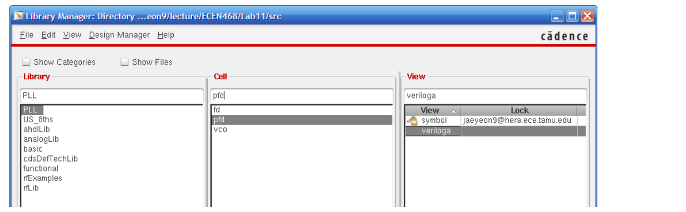

*Figure 13. Library Manager, pfd, fd and vco cells generation*

#### 3.3. Connect Cells and Make PLL

Now we have all cells to make the PLL block. With the cells (`pfd`, `fd`, `vco`), we will connect them together and make the PLL top module. It is also a cell. To create a cell PLL top, click `PLL` in the Library section, and select **File -> New -> Cell View**. And write `plltop` as a cell name and choose schematic as a type of the cell as shown in Figure 14(a). And click **OK**. Then you will see a blank Virtuoso schematic editor (Figure 14(b)).

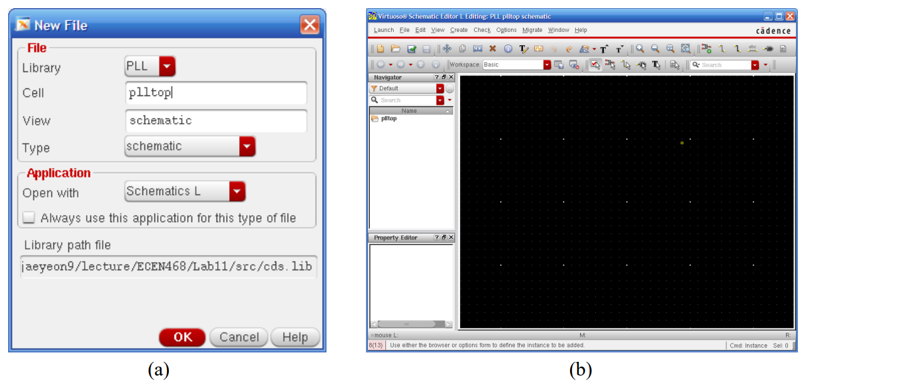

*Figure 14. Creating a cell, plltop*

In the schematic editor, you will load three sub-cells and connect them. Select **Create -> Instance** and write `PLL` as a Library and `pfd` as a cell to place the pfd cell into the schematic editor (Figure 15). Place `fd` and `vco` as well.

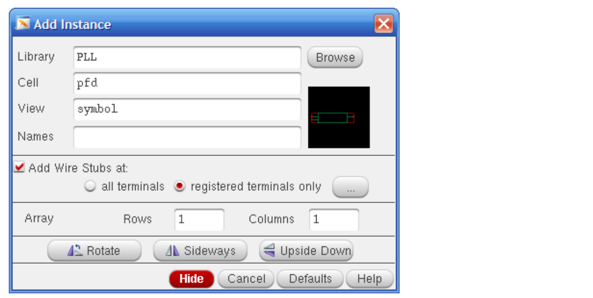

*Figure 15. Creating a cell, plltop*

Also, create a resistor and two capacitors using **Create -> Instance**. And, connect all cells referring to Figure 7 as shown in Figure 16. For the names of library and cell and values, please refer to Table I. To connect the instances, please use wires using **Create -> Wire (narrow)**.

| Component | Library | Cell | Value |
|---|---|---|---|
| Resistor R1 | `analogLib` | `res` | `134.041K` |
| Capacitor C1 | `analogLib` | `cap` | `475p` |
| Capacitor C2 | `analogLib` | `cap` | `32p` |
| Ground | `analogLib` | `gnd` | non |

*Table I. Resistor, Capacitor and Ground*

Figure 16 is the final schematic of the plltop. And, save the file using **File -> Save**.

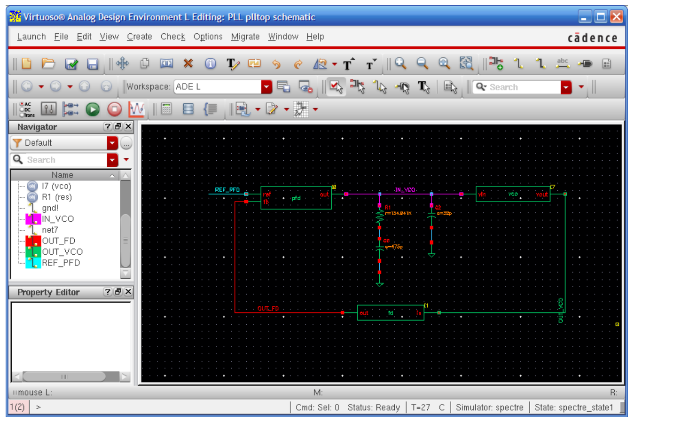

*Figure 16. The final schematic of plltop cell*

#### 3.4. Connect input pulse to PLL

An input pulse source will be used as the input of the plltop. And it will connect to the `ref` port of the pfd cell. Select **Create -> Instance**, and write `analogLib` as a Library name and `vpulse` as a Cell name. Put the specifications of the `vpulse` as `+1V` for Vmax (voltage1), `-1V` for Vmin (voltage2), `100ns` for Period, and `1ns` for Rise time and Fall time. Now we made all circuits to simulate. And click the nets and put each net name for all nets as shown in Figure 17. And then save it to keep the schematic. Once you modify anything in the schematic, you should click **File -> Check and Save**.

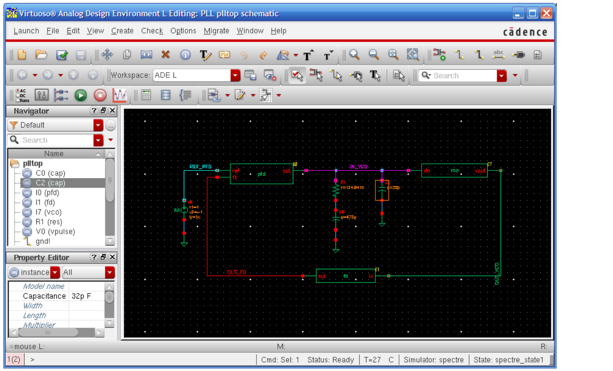

*Figure 17. The schematic of plltop and input pulse*

We will create net names for wires. Please use the net names of Table II. Click **Create -> Wire Name**, put the wire name, and click **Hide**. And, click the wire that you want to put the name on.

| Wires | Wire names |
|---|---|
| `ref` of `pfd` | `REF_PFD` |
| `out` of `fd` | `OUT_FD` |
| `out` of `vco` | `OUT_VCO` |
| `in` of `vco` | `IN_VCO` |

*Table II. Net names*

#### 3.5. Simulation

Now we will simulate the `plltop` module which has been described as a Verilog A and schematic. In the Virtuoso schematic editor, select **Launch -> ADE (Analog Design Environment) L** to invoke the simulator. And select the analysis type using **Analyses -> Choose** (Figure 18). Select `tran` as the Analysis type and put a proper simulation time as the Stop Time. We will simulate it for `50us` in this lab, thus write `50u` in the box. Then, check **moderate** as the Accuracy Defaults, and click **OK**.

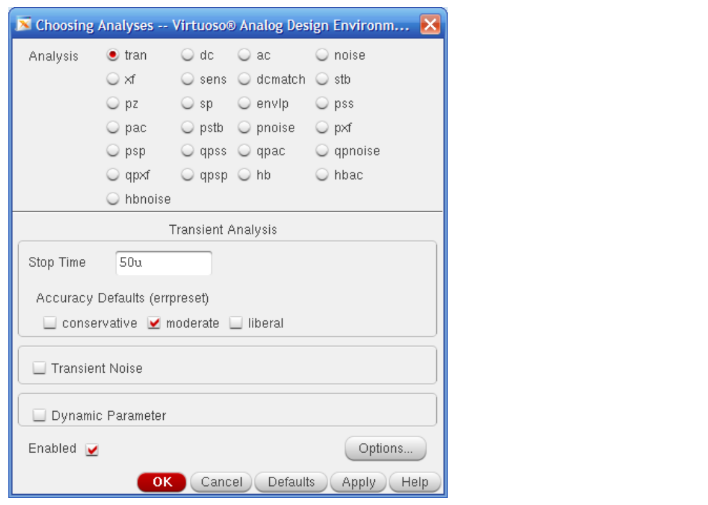

*Figure 18. Analyses Dialog*

In the **Outputs** section of the ADE window, click the right button of the mouse. Then, click **Edit** to choose the wires that we want to plot. And, click **From Schematic** and click the wires we want to plot. Click the nets you want to check and click **OK**. Choose nets `REF_PFD`, `OUT_FD`, `OUT_VCO`, and `IN_VCO`. Then the waveform will be displayed as shown in Figure 21.

You may want to save the current settings for future simulation, so you do not need to set the settings again later when you simulate. Save the current state by selecting **Sessions -> Save state**. Just check **CellView** and click **OK** as shown in Figure 19. When you want to load the saved state, select **Sessions -> Load state** and check **CellView**.

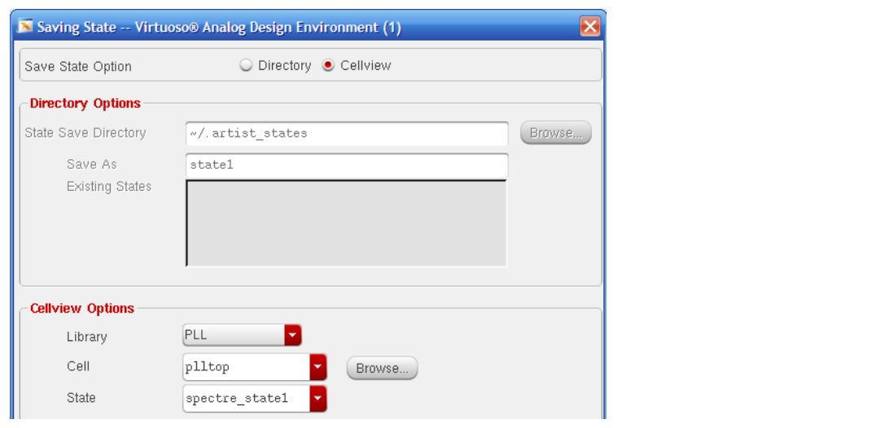

*Figure 19. Saving state*

Now we set all settings for simulation. Then, select **Simulation -> Netlist and run** to simulate the `plltop` with the settings. Then, it will show the simulation status as shown in Figure 20, and the waveform will be displayed as shown in Figure 21.

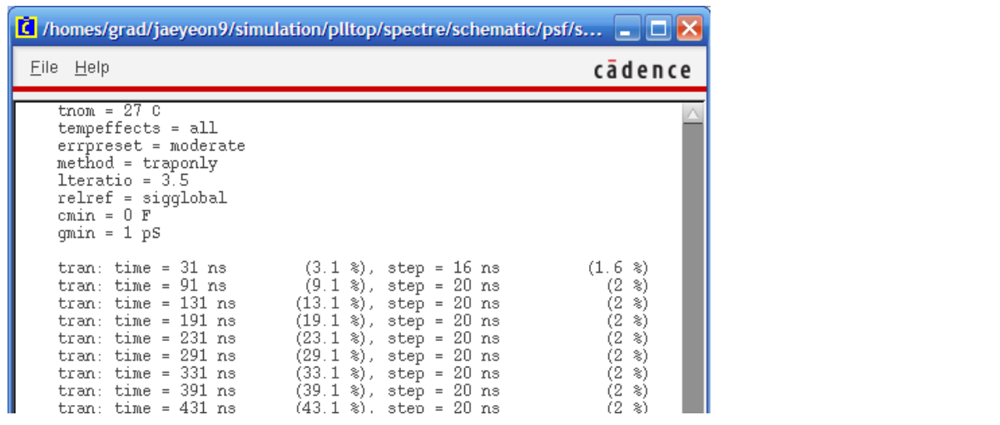

*Figure 20. Simulation process*

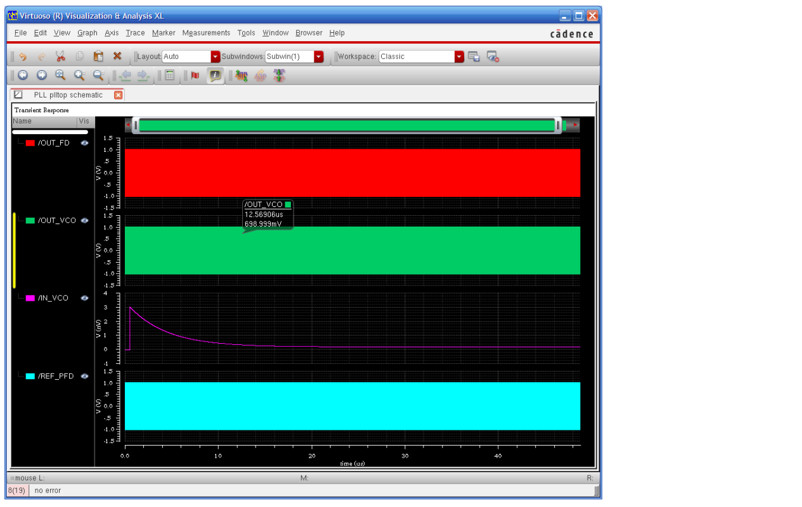

*Figure 21 (a). Final simulation results*

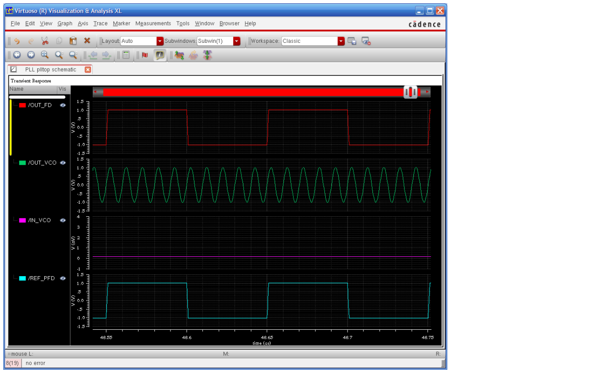

*Figure 21 (b). Final simulation results*

## Requirements

1. General requirements.
   - a. It should control the `PLL` correctly.
   - b. Please make sure the net names and cell names are the same as those described in this manual.
   - c. Late penalty: 20% of the total score will be deducted for each subsequent day after the due date.
2. Please only submit one PDF file with the following items:
   - a. Simulation results including the four nets in Table II (the one like Figure 21).
   - b. Let's assume that you want to generate a 1GHz output of the Voltage Controlled Oscillator with a 1MHz reference clock. Please mention what parts should be modified.

## Verilog-A Code

```verilog
//--------------------------------------------------
// Phase Frequency Detector
//--------------------------------------------------
// VerilogA for PLL, pfd, veriloga

`include "constants.vams"
`include "disciplines.vams"

module pfd(out, ref, fb);
output out; electrical out;  // current output
input ref; voltage ref;      // positive input (edge triggered)
input fb; voltage fb;        // inverting input (edge triggered)
parameter real iout=100u;
parameter real vh=1;
parameter real vl=-1;
parameter real vth=(vh+vl)/2;
parameter integer dir=1 from [-1:1] exclude 0;
// dir=1 for positive edge trigger
// dir=-1 for negative edge trigger
parameter real tt=1n from (0:inf);
parameter real td=0 from [0:inf);
integer state;

analog begin
    // Implement phase detector
    @(cross(V(ref)-vth, dir))
        if (state > -1) state = state - 1;
    @(cross(V(fb)-vth, dir))
        if (state < 1) state = state + 1;
    // Implement charge pump
    I(out) <+ transition(iout*state, td, tt);
end
endmodule
```

```verilog
//--------------------------------------------------
// Frequency Divider
//--------------------------------------------------
// VerilogA for PLL, fd, veriloga

`include "constants.vams"
`include "disciplines.vams"

module fd(out, in);
output out; voltage out;  // output
input in; voltage in;     // input (edge triggered)
parameter real vh=+1;
parameter real vl=-1;
parameter real vth=(vh+vl)/2;
parameter integer ratio=10 from [2:inf);
parameter integer dir=1 from [-1:1] exclude 0;
// dir=1 for positive edge trigger
// dir=-1 for negative edge trigger
parameter real tt=1n from (0:inf);
parameter real td=0 from [0:inf);
integer count, n;

analog begin
    @(cross(V(in) - vth, dir)) begin
        count = count + 1;
        if (count >= ratio)
            count = 0;
        n = (2*count >= ratio);
    end
    V(out) <+ transition(n ? vh : vl, td, tt);
end
endmodule
```

```verilog
//--------------------------------------------------
// Voltage Controlled Oscillator
//--------------------------------------------------
// VerilogA for PLL, vco, veriloga

`include "disciplines.vams"
`include "constants.vams"

`define PI 3.14159265358979323846264338327950288419716939937511

module vco(in, out);
input in;
output out;
voltage in, out;
parameter real amp = 1;
parameter real center_freq = 100M;
parameter real vco_gain = 50M;
parameter integer steps_per_period = 32;
real phase;
real inst_freq;
real real_vout;

analog begin
    inst_freq = center_freq + vco_gain * V(in);
    $bound_step (1.0 / (steps_per_period*inst_freq));
    phase = idtmod(inst_freq,0,1);
    V(out) <+ amp * sin (2 * `PI * phase);
end
endmodule
```
