# Lab 1: SystemC and Simulator

## Objectives

In the first several labs, we will design a separate module of our whole system for every lab and simulate it with a test bench. Finally, we will simulate the entire module, which is designed using SystemC.

SystemC is a system-level modeling language, and Vista is a platform for architecture design. In this lab, we will design a simple memory application with SystemC and use Vista as a tool for simulation and verification.

## Introduction

**SystemC** is a set of C++ classes and macros which provides an event-driven simulation kernel in C++. These facilities enable a designer to simulate concurrent processes, and each is described using plain C++ syntax. SystemC processes can communicate in a simulated real-time environment, using signals of all the datatypes either offered by C++, provided by the SystemC library, or defined by a designer. In certain respects, SystemC deliberately mimics the hardware description language (VHDL and Verilog) but is more aptly described as a system-level modeling language.

**Static Random Access Memory** (SRAM) can be implemented with a storage cell structure that does not require a refresh. Therefore, it operates faster than Dynamic Random Access Memory (DRAM) and is used as fast-cache memory in a computer. As a starting point of our implementation, we will look into a simple SRAM cell, proceed to larger memory blocks with unidirectional data ports, and finally implement a memory block directly.

The block diagram symbol of a primary SRAM cell is shown in Figure 1. It has active-low inputs for Cell Select (CS) and Write Enable (WE). Note the absence of a clock signal. Storage registers and register files are implemented by flip-flops. Still, the storage devices of RAMs, including SRAM and DRAM, are implemented as transparent latches, which support asynchronous storage and retrieval of data and minimize the time a RAM requires service from a shared bus.

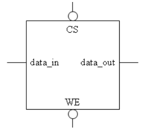

*Figure 1. SRAM cell: block diagram symbol*

A certain SRAM is constructed with many SRAM cells. Also, it is called an SRAM cell array. Figure 2 is an 8x8 SRAM cell array with eight words (one word has eight bits). To write one word (8 bits) into this cell array, only one **CS** signal must be enabled. The signal data\_in and data\_out have 8 bits width.

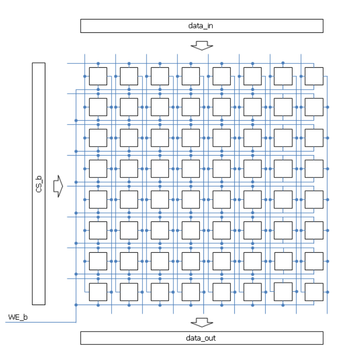

*Figure 2. Cell array of 8 x 8 SRAM*

To generate only one row of cell select signal (CS\_b), an address decoder exists in the SRAM structure. Figure 3 shows the entire structure of 8 x 8 SRAM. The width of **data\_in** and **data\_out** is eight bits in the 8 x 8 SRAM structure. The number of pins for addressing is 3 in the case of 8 x 8 SRAM (2^3 = 8). In addition, CE is added to control the entire circuit of SRAM. When CE is set to 1, all addressing pins become disabled.

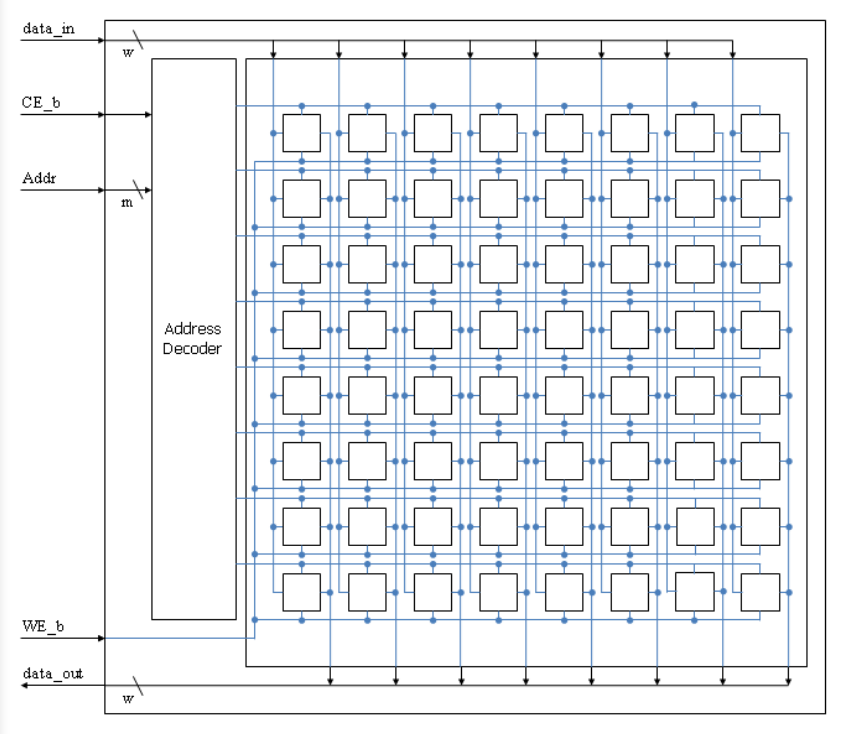

*Figure 3. The entire structure of 8 x 8 SRAM*

## Implementation

**We will now implement a 256K (262,144) x 8 SRAM, which has 18 address pins and 8 data pins.** To generate CS\_b for all memory cells, 18 bits address signals should be decoded to control all 256K cells. The size of the logic to decode will increase if the size of the address pin increases. To minimize the size of control logic in the address decoder, a two-level addressing algorithm can be used. Figure 4 shows an example of two-level addressing in the case of one 8 x 1 SRAM.

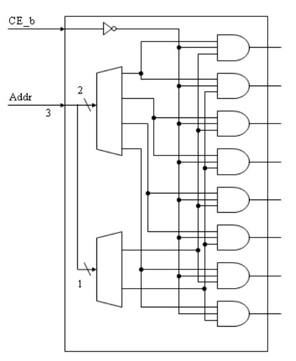

*Figure 4. Address decoder for the 8 x 1 SRAM*

We will use Vista to implement the design. Vista is a native electronic system level (ESL) platform for architecture design, verification, analysis, and virtual prototyping that incorporates an advanced design, verification, and analysis toolset targeted for high-level transaction-level modeling (TLM) hardware platforms.

Please login to the Olympus server and create a working directory for this lab using the following commands.

```bash
## Create and navigate to the working directory.
mkdir -p $HOME/ECEN468/Lab1/src
cd $HOME/ECEN468/Lab1/src
```

Download the zip file (lab1\_code.zip) from Piazza and extract it. In the extracted folders, you will find two files named **“RAM.cpp”** and **“test\_RAM.cpp”**. Copy them to the working directory.

In the terminal, open Vista using the following commands.

```bash
load-ecen-468
source /opt/coe/mentorgraphics/vista312/setup.vista312.linux.bash
vista &
```

Once Vista is launched, create a new project by clicking on **Project** -> **New Project** -> Put **RAM.v2p** as the project name -> Move to **Files** (Figure 5) -> **Add Files** -> add **RAM.cpp** and **test\_RAM.cpp**.

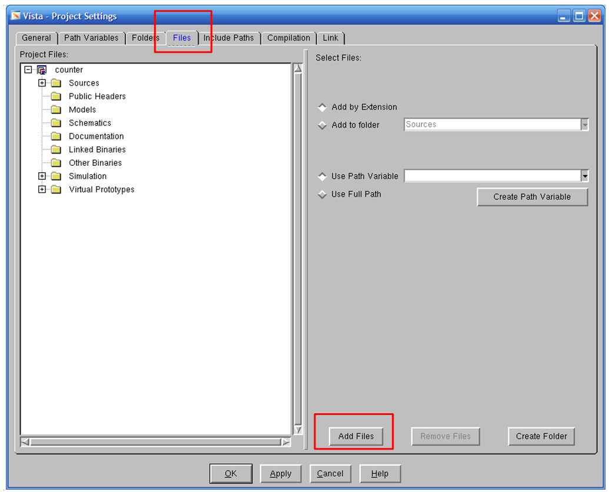

*Figure 5. Project settings window*

Now, please implement the RAM design in **RAM.cpp**. For your reference, an implementation of a 4-bit adder is provided at the end of this manual.

Once you finish your design, please try to compile it to check syntax and behaviors by right-clicking on the tab of your design (RAM) -> Build, as shown in Figure 6.

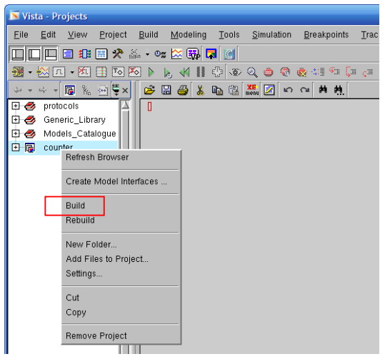

*Figure 6. Screenshot of building project*

## Simulation

Once the design is completed, we want to test its functionality. The functionality of the design module can be tested by applying a testbench module and checking the outputs. The testbench module instantiates the design under test (DUT) and drives the input signals. The testbench can be complied with along with the design module. At the end of the compilation, the simulation results will be displayed. Figure 7 shows the diagram for the 256K x 8 RAM and its testbench.

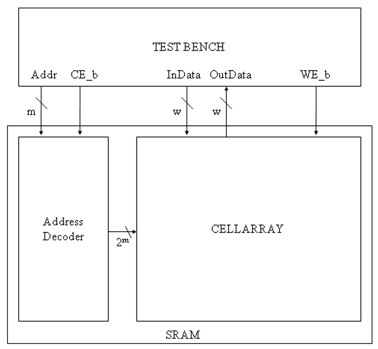

*Figure 7. The block diagram of the SRAM and its testbench*

To simulate the design, expand the hierarchy and clock on **Simulate** as shown in Figure 8. In the pop-up window, ensure the target is filled in with the design name and **de-select** “**Stop After Elaboration**”, as shown in Figure 9. Then click on “OK”.

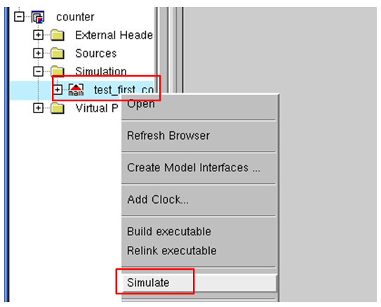

*Figure 8. Screenshot of simulating the project*

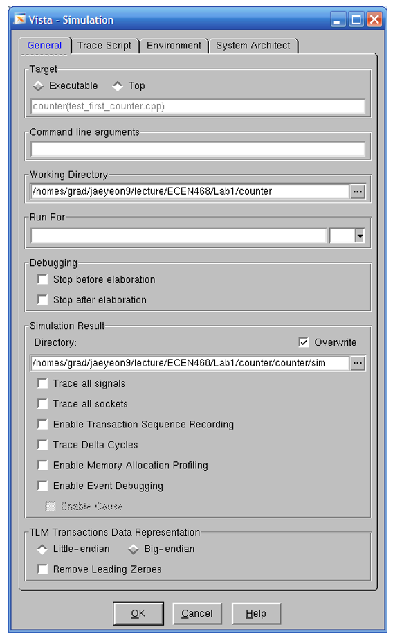

*Figure 9. The window of simulation settings*

After simulation, click on the simulation output frame at the bottom of the window and press “Ctrl-X”, and “Ctrl-S” to save the simulation. Put “**sim.out**” as the filename and press “Enter” to save, as shown in Figure 10.

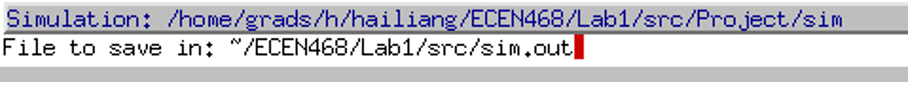

*Figure 10. Saving the simulation*

Once the simulation is completed, the waveform is saved as a file **“\*.vcd”**. We can view the waveform using the software **WaveView**. To launch WaveView, open a new terminal window in the server and run the following commands.

```bash
load-ecen-468
source /opt/coe/synopsys/wv/O-2018.09/setup.wv.sh
wv &
```

In WaveView, open the “\*.vcd” file generated from the simulation to see the waveform. Please refer to Figure 11 for the correct design. Please take a screenshot of the waveform and include it in your lab report.

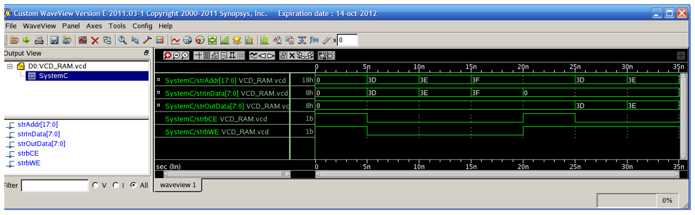

*Figure 11. The waveform of the SRAM*

## Submission

Please only submit one PDF file containing the following items:

1. Screenshots of the waveform with analysis.
2. Screenshots of your code in this design with reasonable comments.
3. Q1: What are the differences between asynchronous and synchronous SRAM?

## Example codes

```cpp
//===========================================
// Function : 4Bit Adder
//===========================================
#include "systemc.h"

#define DATA_WIDTH 4

SC_MODULE (mAdder) {
    sc_in <sc_uint<DATA_WIDTH> > dInA ;
    sc_in <sc_uint<DATA_WIDTH> > dInB ;
    sc_out <sc_uint<DATA_WIDTH+1> > dOut ;

    // ----- Code Starts Here -----
    void function_adder () {
        dOut.write(dInA.read()+dInB.read());
    }

    // ----- Constructor for the SC_MODULE -----
    // sensitivity list
    SC_CTOR(mAdder) {
        SC_METHOD (function_adder);
        sensitive << dInA << dInB;
    }
};
```

```cpp
int sc_main (int argc, char* argv[]) {
    // Declare Input/Output Signals
    sc_signal < sc_uint<DATA_WIDTH> > tInA;
    sc_signal < sc_uint<DATA_WIDTH> > tInB;
    sc_signal < sc_uint<DATA_WIDTH+1> > tOut;

    int i,j;

    // Connect the DUT(Design Under Test)
    mAdder Adder_01("SIMULATION_adder");
    Adder_01.dInA(tInA);
    Adder_01.dInB(tInB);
    Adder_01.dOut(tOut);

    // Open VCD(Value Change Dump) file
    sc_trace_file *wf = sc_create_vcd_trace_file("VCD_ADDER");

    // Dump the desired signals
    sc_trace(wf, tInA, "strInA");
    sc_trace(wf, tInB, "strInB");
    sc_trace(wf, tOut, "strOut");

    // Initialize all variables
    tInA.write(0);
    tInB.write(0);
    sc_start(5);

    // Behavior
    for(i=0; i<16; i++){
        tInA.write(i);
        for(j=0; j<16; j++){
            tInB.write(j);
            sc_start(2);
            cout << "@" << sc_time_stamp() << ":: [" << tInA << "]+["
                 << tInB << "]=[" << tOut << "]" << endl;
        }
    }

    // Close trace file
    sc_close_vcd_trace_file(wf);

    return 0; // Terminate simulation
}
```
